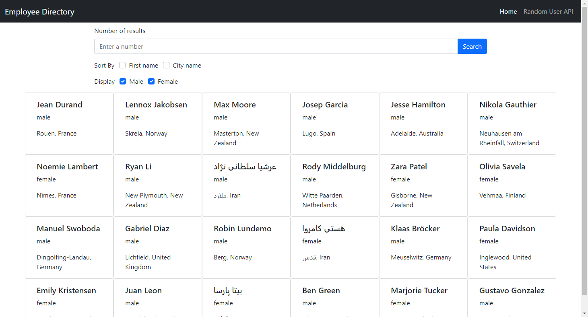

# Unit 19 React Homework: Employee Directory

## Description
This is an app that can be used to search for a number of randomly generated user information cards, as well as apply some basic filters on them.

This app is deployed on github pages at [https://sinsinkun.github.io/UTOR-ReactDirectory/](https://sinsinkun.github.io/UTOR-ReactDirectory/).

## Table of Contents
* [Usage](#usage)
* [License](#license)

## Usage
Enter any integer number into the search bar and hit search to initiate a new search. Check the sort by and display checkboxes to sort and filter the information as you see fit.

## License
ISC License: Copyright (C) 2021 JingChang Xiao 

Permission to use, copy, modify, and/or distribute this software for any purpose with or without fee is hereby granted, provided that the above copyright notice and this permission notice appear in all copies. 

THE SOFTWARE IS PROVIDED "AS IS" AND THE AUTHOR DISCLAIMS ALL WARRANTIES WITH REGARD TO THIS SOFTWARE INCLUDING ALL IMPLIED WARRANTIES OF MERCHANTABILITY AND FITNESS. IN NO EVENT SHALL THE AUTHOR BE LIABLE FOR ANY SPECIAL, DIRECT, INDIRECT, OR CONSEQUENTIAL DAMAGES OR ANY DAMAGES WHATSOEVER RESULTING FROM LOSS OF USE, DATA OR PROFITS, WHETHER IN AN ACTION OF CONTRACT, NEGLIGENCE OR OTHER TORTIOUS ACTION, ARISING OUT OF OR IN CONNECTION WITH THE USE OR PERFORMANCE OF THIS SOFTWARE.